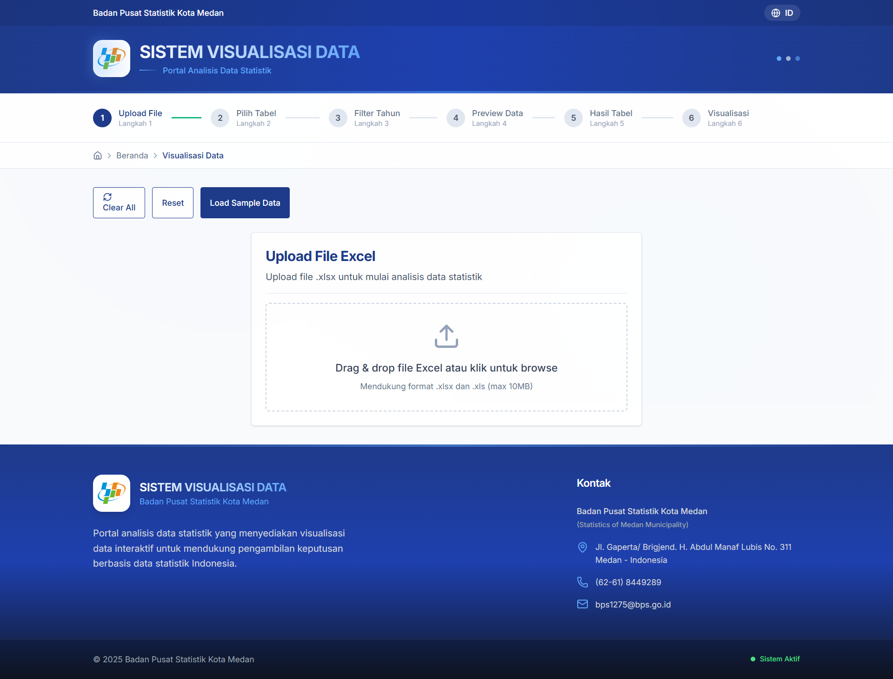

# Panduan Penggunaan Website Visualisasi Data

Website ini membantu Anda memuat data (Excel), memilih tabel dan tahun, melihat tabel hasil, memvisualisasikan dalam berbagai jenis chart, serta mengekspor ke PDF/Excel/CSV.

## Fitur Utama
- Upload Excel (.xlsx/.xls), pendeteksian multi-sheet otomatis
- Pilih maksimal 2 tabel untuk dianalisis secara bersamaan
- Deteksi otomatis kolom tahun dari header atau baris awal data
- Filter Tahun (Select All/Deselect All)
- Preview Data: verifikasi & pembersihan cepat (Clean Chart Data)
- Hasil Tabel: pilih baris lalu hapus (Hapus Baris)
- Visualisasi: Bar, Line, Pie, Doughnut; atur tinggi chart; pilih tahun untuk Pie/Doughnut
- Kontrol tampilan: tampil/sembunyi chart per tabel, layout Grid/List
- Ekspor:
  - PDF: chart tunggal, banyak chart (Grid/List), seluruh dashboard
  - Data: Excel (.xlsx) dan CSV

## Alur Singkat (6 Langkah)
1) Upload File: unggah Excel atau gunakan tombol “Load Sample Data”.
2) Pilih Tabel: pilih maks 2 tabel (tersisa akan terlihat). Klik “Lanjut ke Filter Tahun”.
3) Filter Tahun: pilih tahun yang tersedia (atau “Select All Years”). Klik “Lanjut ke Preview Data”.
4) Preview Data: opsi “Clean Chart Data” dan “🔍 Verify Filtering”, lalu “Buat Tabel Hasil”.
5) Hasil Tabel: Anda dapat memilih baris dan “Hapus Baris”, serta “Export Excel”. Lanjutkan ke “Visualisasi Lengkap”.
6) Visualisasi: atur jenis/tinggi chart per tabel, tampil/sembunyi chart, pilih Layout (Grid/List), dan gunakan menu Export.

## Memuat Sample Data
- Klik “Load Sample Data” (beranda atau langkah 1).
- Sistem otomatis:
  - Memuat 3 tabel sampel (TPAK, Penduduk Bekerja, TPT)
  - Memilih 2 tabel pertama
  - Menandai semua tahun terdeteksi (2020–2023)
  - Menampilkan tutorial singkat di langkah 2–3

## Mengunggah Excel
- Format: .xlsx/.xls (maks 10MB)
- Setelah unggah, semua sheet valid akan terdaftar (nama, jumlah baris/kolom)
- Sistem mencoba mendeteksi tahun dari header dan beberapa baris awal

Tips format data:
- Baris header mengandung teks kolom (kolom 1 biasanya nama wilayah/kategori, kolom berikutnya tahun)
- Tahun boleh berupa angka 4 digit (mis. 2020) atau teks yang memuat tahun (mis. “Data 2023”)

## Memilih Tabel (Maks 2)
- Di langkah “Pilih Tabel”, cari dan pilih hingga 2 tabel
- Mengubah pilihan tabel akan menyetel ulang pilihan tahun agar sesuai dengan tabel terpilih

## Filter Tahun
- Sistem menampilkan daftar tahun yang terdeteksi dari tabel terpilih
- Gunakan “Select All Years” untuk memilih/meniadakan semua tahun

## Preview Data
- Clean Chart Data: menghapus baris catatan/footer atau baris kosong (baris tahun tidak dihapus)
- 🔍 Verify Filtering: menampilkan pemeriksaan detail di console browser
- Lanjutkan dengan “Buat Tabel Hasil”

## Hasil Tabel
- Tampilkan setiap tabel sebagai tabel individual
- Pilih baris via checkbox, lalu “Hapus Baris” untuk menghapus massal
- Export Excel dari halaman ini untuk menyimpan hasil tabel terpilih

## Visualisasi
- Jenis chart per tabel: Bar, Line, Pie, Doughnut
- Tinggi chart: kecil–sangat besar
- Pie/Doughnut: pilih tahun spesifik jika Anda memilih banyak tahun
- Tampilkan/Sembunyikan chart per tabel
- Layout Mode: Grid atau List (berpengaruh pada cara ekspor PDF multi-chart)

## Ekspor
1) Export Excel/CSV (Data)
   - Panel “Export Data” pada halaman Visualisasi
   - Excel menyertakan sheet Ringkasan + tiap tabel
   - CSV menyertakan ringkasan dan data tabel berurutan

2) Export Chart Tunggal (PDF)
   - Tombol ikon gambar di header setiap chart
   - PDF menyertakan: judul chart, metadata (sumber, tanggal, jenis chart), gambar chart, Data Values, dan Data Summary

3) Export Banyak Chart (PDF)
   - Tombol “Export Charts” di panel “Export PDF”
   - Mode List: satu chart per halaman dengan judul/metadata, diikuti Data Values lalu Data Summary
   - Mode Grid (disarankan ketika tepat 2 chart terlihat): kedua chart di satu halaman dengan judul perbandingan multi-baris; di bawah tiap chart ada Data Values kemudian Data Summary. Label kolom/sel pertama akan dipendekkan otomatis untuk mencegah overflow

4) Export Dashboard (PDF)
   - Tombol “Export Dashboard” di panel “Export PDF”
   - Menangkap seluruh tampilan dashboard. Jika panjang, otomatis terbagi menjadi beberapa halaman
   - Halaman ringkasan opsional menampilkan agregat: total wilayah, total tahun, data points, rata-rata, maksimum, minimum

Catatan ekspor PDF:
- Kualitas gambar ditingkatkan; metadata PDF diset otomatis
- Tabel “Data Values” selalu didahulukan, lalu “Data Summary”
- Abbreviation otomatis untuk label panjang pada kolom pertama agar muat di halaman

## Troubleshooting
- Tahun tidak terdeteksi: pastikan kolom tahun berisi angka 4 digit atau teks yang memuat tahun. Rentang yang didukung ~1990 hingga tahun berjalan + 5
- Nilai numerik: angka dengan pemisah “,” atau “.” akan diparsing otomatis; maksimum 3 desimal di ringkasan
- File terlalu besar: pastikan < 10MB

## Teknologi yang Digunakan
- Frontend: React + Vite, Tailwind CSS
- Charting: Chart.js + react-chartjs-2
- Ekspor PDF: jsPDF + html2canvas
- Ekspor Excel/CSV: xlsx

## Keamanan & Privasi
- Data Anda diproses di sisi klien (browser) untuk visualisasi dan ekspor

## Saran Penggunaan
- Gunakan Layout Grid saat mengekspor tepat 2 chart untuk perbandingan dalam 1 halaman
- Manfaatkan Clean Chart Data sebelum ekspor agar ringkasan dan tabel nilai lebih akurat
